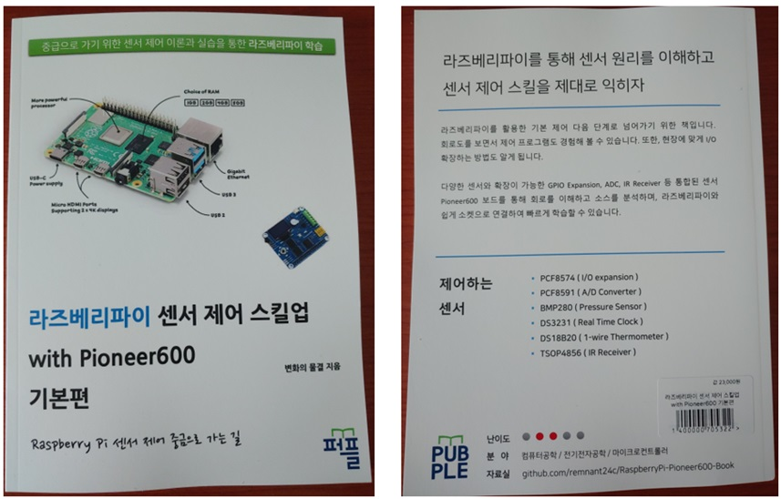

## 라즈베리파이 센서 제어 스킬업 with Pioneer600 기본편

부재 : Raspberry Pi 센서 제어 중급으로 가는 길

 책에 대한 소스와 관련 첨부파일에 대한 자료실(github) 입니다. 이번 편은 기본편으로 라즈베리파이를 이용해서 Pioneer600 센서 모듈을 사용방법을 학습해보았습니다.

Raspberry Pi4와 Pioneer600가 기본으로 필수이며, 나머지 점퍼선, LED 등이 있으면 좀더 많은 테스트를 해볼 수 있습니다.

--------------------------------------------------------------------------------------
###[안내] 2024년 6월29일 이전 교보문고 POD 도서로 구매한 분들에게 전달드립니다.

 2024년 6월 29일 이전에 책을 구매하신 분에게는 수정된 내용 파일로 전달해 드리고자 합니다.
 소스코드와 결과는 다르지 않으나 설명에 오타 수정과 내용 수정이 조금 있습니다.
 구매 일자 증빙 캡처와 47페이지 한 장 찍어 메일로 보내주시면 됩니다.

 한 번 더 검수하지 못한 점 사과드리며, 불편하게 해서 죄송합니다.
 7월 이후부터 책을 구매하신 분은 수정된 내용이 적용되었습니다.

 1. 요청 이메일 주소
   remnant24c@gmail.com
 2. 보내실 때 메일 제목
   [요청] 24년 6월 라즈베리파이 센서 제어 스킬업 with Pioneer600 구매함
--------------------------------------------------------------------------------------

## **목 차**

1. 들어가며
2. Raspberry Pi에 OS 설치
3. Pioneer600 모듈 설명 및 LED Control (GPIO)
4. LED Control (PWM)
5. Joystck(KeyPad) Control
6. OLED화면에 출력하기 with SPI
7. PCF8574 Control (I/O Expansion)
8. BMP280 (Pressure, Temperature)
9. DS3231 (Real Time Clock)
10. DS18B20 (1-wire Temperature)
11. TSOP4856 (IR Receiver)
 

**원본 소스 출처 :** https://files.waveshare.com/upload/3/3a/Pioneer600_code.zip

**책 관련 문의 메일 주소 :** 
remnant24c@gmail.com
